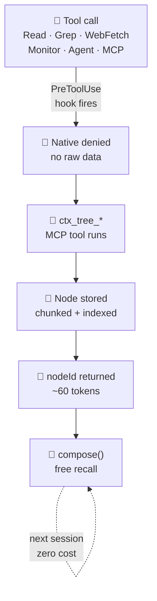

<div align="center">


[](https://discord.com/channels/1486035859747897414/1508913149267542118) [](https://discord.gg/Fjc9zYHZyV)

# 🌳 ctx-tree

### Context rot, eliminated.

*ctx-tree intercepts every Claude Code tool call — native and MCP — and routes content through a persistent SQLite graph. Claude gets compact node references instead of raw data. 95–99% context reduction. Knowledge accumulates across sessions.*

[](LICENSE)
[](#development)
[](https://bun.sh)
[](https://github.com/joeblackwaslike/mcp-exec)
[](https://joeblackwaslike.github.io/ctx-tree/how-it-works.html)

</div>

---

Your Claude session is doing real work — reading source files, grepping for symbols, fetching docs, spawning agents. And every single one of those tool calls is **dumping raw data straight into the context window.**

By the time you're 60% through a complex task, the window is stuffed with file contents that already answered their question, grep output nobody needs anymore, and a web page from two subtasks ago. Claude starts forgetting the beginning. You lose the thread. The session dies before the work is done.

**That's context rot. Every developer using Claude Code hits it. ctx-tree aims to eliminate it.**

Every tool call — native *and* MCP — is intercepted by a hook, the result is stored in a persistent SQLite property graph, and Claude gets back a compact `nodeId` reference instead of raw bytes. The same file read next week costs zero tokens. It's already in the graph.

---

## Before / After

<table>
<tr>
<th width="50%">❌ Without ctx-tree</th>
<th width="50%">✅ With ctx-tree</th>
</tr>
<tr>
<td>

```
Read auth.ts         →  4,200 tokens, session only
                        gone when context scrolls
                        re-read it again next session

Grep 'handleToken'   →  8,400 tokens, session only
                        8 files inline, all forgotten
                        same grep, same cost, next week

WebFetch API docs    → 11,000 tokens, session only
                        full HTML, 90% noise
                        re-fetched every session

Session stalls at ~40k tokens.
Start over.
```

</td>
<td>

```
Read auth.ts         →     60 tokens (nodeId)
                        stored in graph, forever
                        free recall next session

Grep 'handleToken'   →    160 tokens (8 nodes)
                        searchable across sessions
                        neighbors found in one call

WebFetch API docs    →    110 tokens (reference)
                        compact a11y tree stored
                        never re-fetched

Session runs to completion.
Keep going.
```

</td>
</tr>
</table>

| Operation | Without | With | Saved |
| --------- | ------- | ---- | ----- |
| Read file | ~4,200 tok | ~60 tok | **98.6%** |
| Grep (8 files) | ~8,400 tok | ~160 tok | **98.1%** |
| WebFetch | ~11,000 tok | ~110 tok | **99.0%** |
| MCP tool | ~3,600 tok | ~70 tok | **98.1%** |

---

## Install

```sh
# Add the marketplace — one-time global setup
/plugin marketplace add joeblackwaslike/agent-marketplace

# Install ctx-tree — MCP server, all 9 hooks, skills configured automatically
/plugin install ctx-tree@agent-marketplace
```

That's it. Start a new Claude Code session. Every tool call is already being intercepted.

<details>
<summary>Requirements</summary>

macOS arm64 or Linux x64/arm64 · [Bun ≥1.1](https://bun.sh) · `rg ≥13`

```sh
brew install bun ripgrep          # macOS
curl -fsSL https://bun.sh/install | bash && apt install ripgrep  # Linux
```

</details>

---

## What you get

**98–99% context reduction per operation.** Every read, search, and fetch that used to cost thousands of tokens now costs tens. Operations you've already run cost *nothing* — the graph remembers.

**Zero configuration. Total interception.** Ten hooks fire automatically across every native Claude Code tool and every MCP tool you have installed. Nothing slips through. No per-project setup. No flags to flip.

**Knowledge that outlasts the session.** Prior reads, searches, and web fetches are available next week via `ctx_tree_search` and `ctx_tree_compose`. The graph grows with every session. The context stays lean.

---

## How it works



→ **[Interactive walkthrough — every node type, hook, pipeline, and search pattern](https://joeblackwaslike.github.io/ctx-tree/how-it-works.html)**

---

## MCP tools

| Tool | What it does |
| ---- | ------------ |
| `ctx_tree_read` | Read file with tree-sitter semantic chunking. Returns nodeId + symbol index. |
| `ctx_tree_grep` | Ripgrep search — results stored as typed graph nodes. |
| `ctx_tree_browse` | Fetch a URL, store as `web_content` node with accessibility tree. |
| `ctx_tree_search` | FTS5 keyword search across all stored nodes — current and prior sessions. |
| `ctx_tree_compose` | Budget-bounded context bundle from seed nodeIds. No re-reads. |
| `ctx_tree_neighbors` | Graph walk from a node — callers, imports, siblings, summaries. |
| `ctx_tree_path_to_root` | Walk parent chain from any node to session root. |
| `ctx_tree_recent` | Surface nodes from prior sessions. Instant orientation on re-entry. |
| `ctx_tree_monitor` | Stream command output as chunk nodes. Supports stdin sends. |
| `ctx_tree_note` | Manually store an observation or note node with optional edges. |

---

## Hooks

Ten hooks, installed automatically. You don't configure them.

| Event | Hook | What it intercepts |
| ----- | ---- | ------------------ |
| `SessionStart` | `session-start.mjs` | Injects tool guide and redirect reminders on startup / resume |
| `UserPromptSubmit` | `userpromptsubmit-capture.mjs` | Stores every prompt as a `prompt` node; wires `follows` edge to preceding response |
| `Stop` | `stop-response-capture.mjs` | Reads transcript; stores `thinking` + `response` nodes; wires full `follows` + `derived_from` chain per turn |
| `PreToolUse` | `pretooluse-redirect.mjs` | **Read, Grep, Bash (grep/cat), WebFetch, Monitor** → denied + replaced with ctx-tree equivalent |
| `PreToolUse` | `pretooluse-agent-enrich.mjs` | **Agent** → subagent prompt enriched with ctx-tree tool map + FTS context hits from prior work |
| `PreToolUse` | `pretooluse-skill-recall.mjs` | **Skill** → cache hit returns stored node; cache miss passes through and stores for next time |
| `PreToolUse` | `pretooluse-proxy.mjs` | Soft advisory mode when `~/.ctx-tree/proxy-mode` flag is set — nudges without blocking |
| `PostToolUse` | `posttooluse-agent-capture.mjs` | **Agent** → summary node created, `summarizes` edges wired to everything the subagent touched |
| `PostToolUse` | `posttooluse-skill-capture.mjs` | **Skill** → content stored as `skill://name` node for instant recall next invocation |
| `PostToolUse` | `posttooluse-websearch-capture.mjs` | **WebSearch** → result URLs browsed and stored in background, searchable next session |

---

## Built on

ctx-tree is built on **[mcp-exec](https://github.com/joeblackwaslike/mcp-exec)** — a context-efficient MCP workflow engine that runs multi-step tool chains in a sandboxed environment and returns only the final output to the model's context window. If you build Claude Code tools and care about token efficiency, read it.

---

## Coming soon

> **EdgeLight backend.** ctx-tree's SQLite store will gain an optional backend powered by EdgeLight — a custom single-file embedded graph database (no server, no daemon, nothing to install). EdgeLight brings a proper property graph query language, richer edge semantics, and faster traversal, while keeping the zero-install per-project isolation that makes ctx-tree work anywhere. Being built now. Star to follow along.

---

## Development

```sh
git clone https://github.com/joeblackwaslike/ctx-tree
git config core.hooksPath .githooks   # auto-rebuilds dist on commit
bun install
```

---

<div align="center">

[📊 How It Works](https://joeblackwaslike.github.io/ctx-tree/how-it-works.html) · [⚡ Quick Overview](https://joeblackwaslike.github.io/ctx-tree/mini.html) · [📄 Design Spec](docs/superpowers/specs/2026-05-17-ctx-tree-design.md) · [Agent Marketplace](https://github.com/joeblackwaslike/agent-marketplace) · [mcp-exec](https://github.com/joeblackwaslike/mcp-exec)

</div>
